# Flower of Life Neural Networks

**Обучаемые нейросети на геометрических решётках, порождённых принципом «Цветка жизни».**
Узлы — окружности (в 3D — шары), рёбра — их пересечения, сигнал распространяется
волнами по решётке. Серия из 12 экспериментов на чистом numpy с ручным backprop.

---

## От картинки к вопросу

Всё началось с простого наблюдения. Если рисовать окружности по принципу «Цветка
жизни» — каждая новая проходит через центры соседних — они разрастаются во все
стороны, покрывая плоскость правильной сеткой пересечений. В объёме то же делают
шары, заполняя всё пространство.

Вопрос: **можно ли превратить эту геометрию в обучаемую нейросеть?** Не нарисовать
красивую картинку, а построить структуру с весами, которая чему-то учится — и
проверить, даёт ли сама геометрия что-нибудь измеримое, или это просто эстетика.

Короткий ответ, к которому пришла вся серия: **да, структура обучаема, и её геометрия
делает измеримую работу — но особенна не шестиугольность, а регулярность,
локальность и общие веса, которые Цветок жизни воплощает.**

---

## Архитектура

Перевод геометрии на язык нейросети прямой:

| Элемент Цветка жизни | Элемент сети |
|---|---|
| Окружность / шар | Узел с вектором состояния (размерность 8) |
| Пересечение окружностей | Ребро графа (связь) |
| Распространение узора | Message passing: K волн сигнала по рёбрам |
| Самоподобие узора | Общие веса: одно локальное правило у всех узлов |

На каждом шаге узел смешивает своё состояние со средним состоянием соседей:

```
h ← tanh( h·Ws + mean(соседи)·Wn + b )
```

Правило одно на все узлы и все шаги — как ядро свёртки. Отсюда всего **203
обучаемых параметра независимо от размера решётки**. Ответ читается глобальным
пуллингом (mean + max) либо, в задаче локализации, вниманием по координатам узлов.

Реализация — чистый numpy, ручной backprop, проверенный численным градиентом до
6 знаков, оптимизатор Adam. Никаких ML-фреймворков.

---

## 1. Обучаемость в 2D

127 окружностей (6 колец), задача — классификация зашумлённых узоров: кольцо,
пятно, полоса. Точность **96.5%**. Видно, как входной узор волнообразно растекается
по решётке за 1 → 4 → 8 шагов — тот самый принцип распространения окружностей,
только для сигнала.

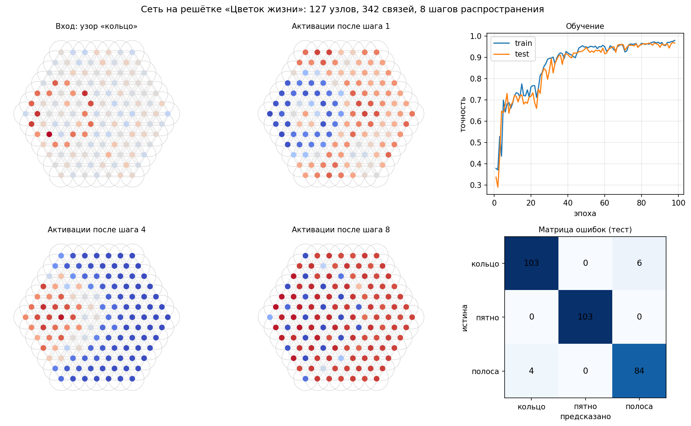

---

## 2. Обучаемость в 3D (FCC-упаковка)

249 шаров в плотнейшей упаковке (12 касающихся соседей), классы: оболочка, сгусток,
слой. Точность **94%**. Красивая деталь слева внизу: срез структуры по плоскости
(111) — это в точности плоский Цветок жизни из первого эксперимента. Плоская
картинка оказывается одним слоем объёмной структуры.

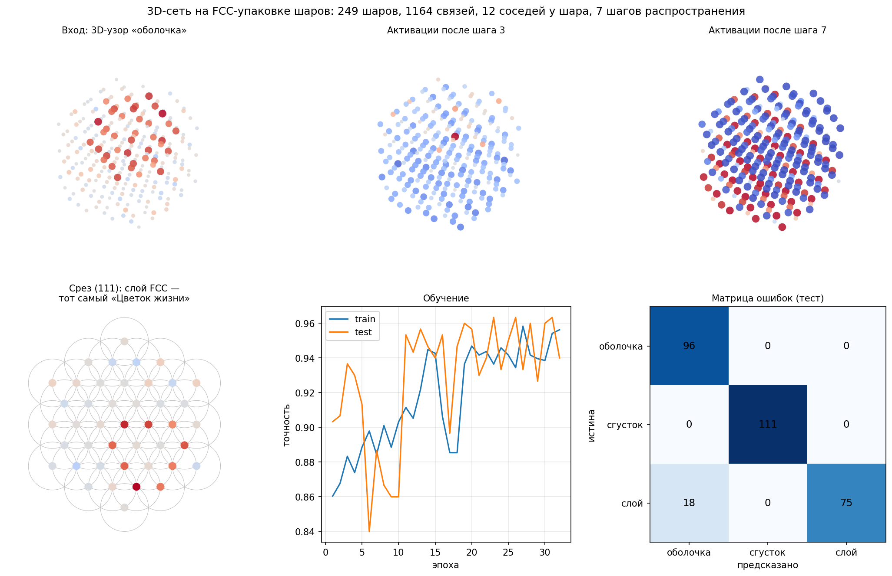

---

## 3. Растущая сеть

Буквальное прочтение исходного рисунка: сеть начинается с **одной окружности** и
наращивает кольца, когда качество выходит на плато. Итог совпадает с фиксированной
решёткой (95.0% против 94.7%), но число параметров при росте не меняется —
выученное правило мгновенно наследуется новыми узлами. После каждого наращивания
(пунктир) точность растёт скачком, без провалов.

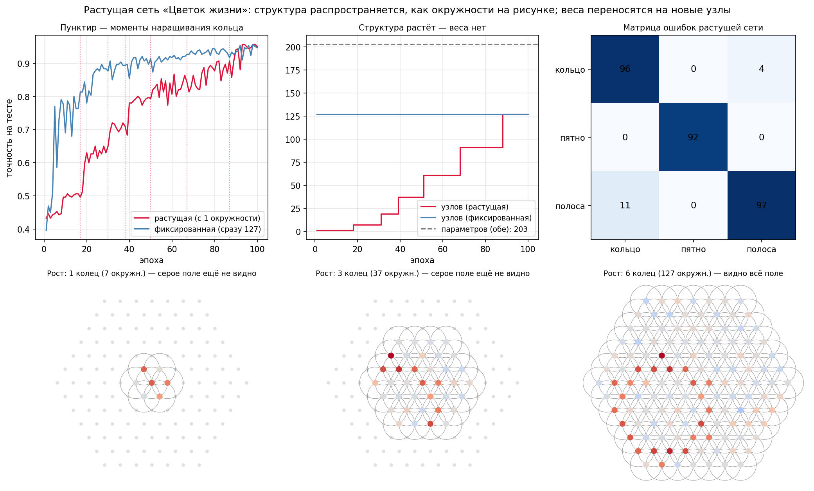

---

## 4. Радиус как правило связности

При радиусе окружности, равном шагу решётки, она пересекается не только с 6
ближайшими соседями, но и со вторым поясом. Сравнение плотности связей и числа шагов
волны:

| Конфигурация | Точность | Сообщений за прогон |
|---|---|---|
| 6 соседей, K=4 | 0.942 | 1368 |
| 6 соседей, K=8 | 0.942 | 2736 |
| **12 соседей, K=4** | **0.965** | 2592 |
| 12 соседей, K=8 | 0.934 | 5184 |

Плотный граф с короткой волной — оптимум. Избыток шагов вредит: состояния узлов
усредняются до неразличимости (пере-сглаживание).

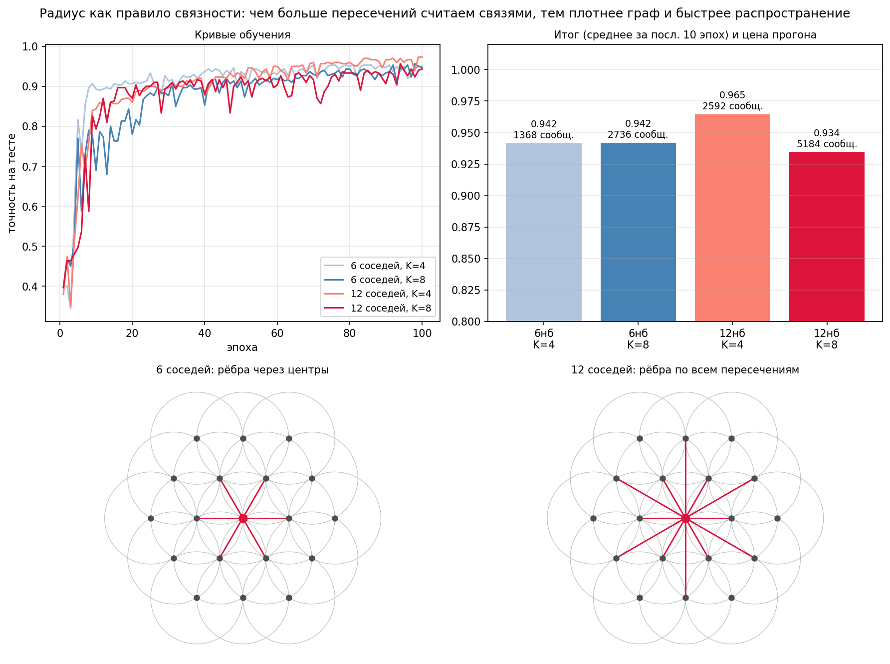

---

## 5. Стоит ли геометрия чего-нибудь?

Ключевой эксперимент. Одни и те же данные, четыре модели:

| Модель | Точность | Параметров |
|---|---|---|
| Логистическая регрессия (без структуры) | 0.730 | 384 |
| MLP (без структуры) | 0.916 | 8 387 |
| Случайный граф (контроль) | 0.783 | 203 |
| **Решётка Цветка жизни** | **0.965** | **203** |

Контроль со случайно перемешанными связями — те же 203 параметра, тот же механизм,
но геометрия разрушена. Падение с 96.5% до 78.3% — это **вклад чистой геометрии,
около 18 пунктов**. Решётка со 203 параметрами бьёт MLP с 8 387.

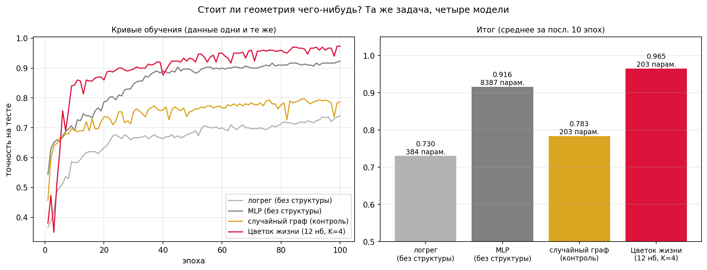

---

## 6. Фальсификация: особенны ли шестиугольники?

Честная проверка гипотезы. Квадратная решётка, тот же протокол: квадрат с 8 соседями
даёт ровно те же 0.965, что и гекс с 12; квадрат с 4 соседями (0.953) даже обходит
гекс с 6 (0.942).

**Гипотеза «гекс лучше» опровергнута.** Работает не магия шестиугольников, а
регулярность как таковая. За гексом остаются негеометрические аргументы
(изотропность, плотнейшая упаковка в 3D), но на этой задаче они не проявились.

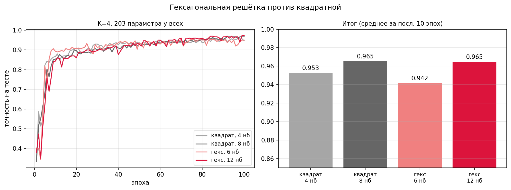

---

## 7. Zero-shot перенос на другой размер

Веса, обученные на 127 узлах, приложены **без дообучения** к решёткам до 469 узлов
(поле в 3.7 раза больше): 97.3% → 95.0% → 90.7% → 88.0%. Деградация плавная. У MLP
такой перенос невозможен в принципе — у него размер входа зашит в веса.

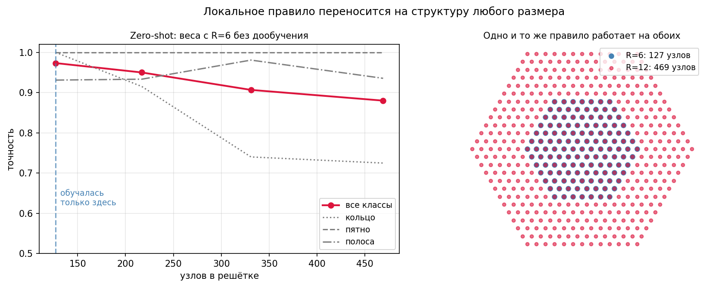

---

## 8. 18 центров: находка из AutoCAD

При построении 3D-модели в CAD выяснилось: по правилу Цветка жизни у шара не 12
соседей, а **18** — 6 в своей плоскости, 6 сверху и 6 снизу (верхний и нижний малые
шестигранники радиуса r/√3, повёрнутые на 30°, на высоте ±r·√(2/3)).

Проверка подтвердила математику полностью. Разница с 12 объясняется правилом связи:
12 — максимум для *касающихся* шаров (классическая задача Ньютона о числе контактов),
18 — для правила «центр соседа лежит на сфере» со взаимопроникающими шарами.
Порождаемая решётка не FCC, она втрое плотнее. На зашумлённой задаче 18-связность
дала **0.884** против 0.869 у FCC-12.

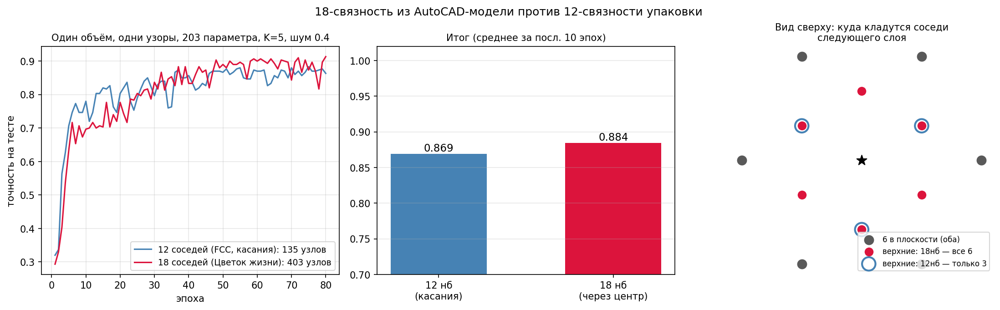

---

## 9. Живучесть

Обученную решётку повреждали на инференсе без дообучения. Деградация плавная —
обходные пути работают:

| Повреждение | 10% | 25% | 50% |
|---|---|---|---|
| Узлы | 0.925 | 0.857 | 0.665 |
| Связи | 0.951 | 0.905 | 0.617 |

При потере половины узлов сеть держит 66.5%. Урок эксперимента: хрупким местом
оказалась не распределённая решётка, а единственная централизованная операция —
глобальный пуллинг (его пришлось чинить, исключив мёртвые узлы из агрегации).

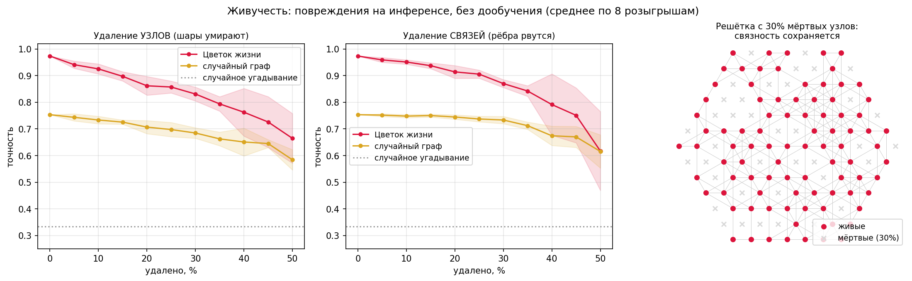

---

## 10. Эффективность по данным

Шум 0.4, 3D, обучающая выборка от 50 до 900 примеров:

| Примеров | Логрег | MLP | Случайный граф | 18 центров |
|---|---|---|---|---|
| 50 | 0.523 | 0.523 | 0.870 | **0.937** |
| 100 | 0.613 | 0.603 | 0.840 | **0.960** |
| 300 | 0.667 | 0.687 | 0.833 | **0.873** |
| 900 | 0.753 | 0.830 | 0.850 | **0.923** |

**Решётке хватило 50 примеров, чтобы обойти MLP, обученный на 900.** Структура — это
знание, вшитое до обучения, и оно ценнее всего при дефиците данных.

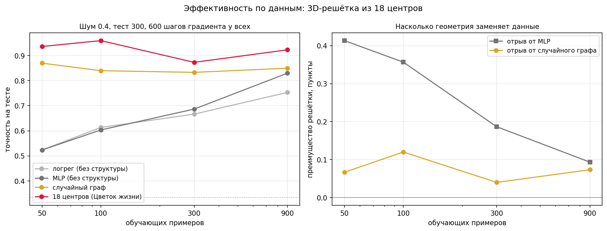

---

## 11. Перенос из сечения в объём (2D → 3D)

Правило, обученное на плоском срезе (99% на 2D-задачах), приложено к объёму без
дообучения: **71.3%**. Сгусток переносится идеально (изотропен в любой размерности),
оболочка и слой путаются — правило «узнаёт сечения», но объёмная статистика ему
незнакома.

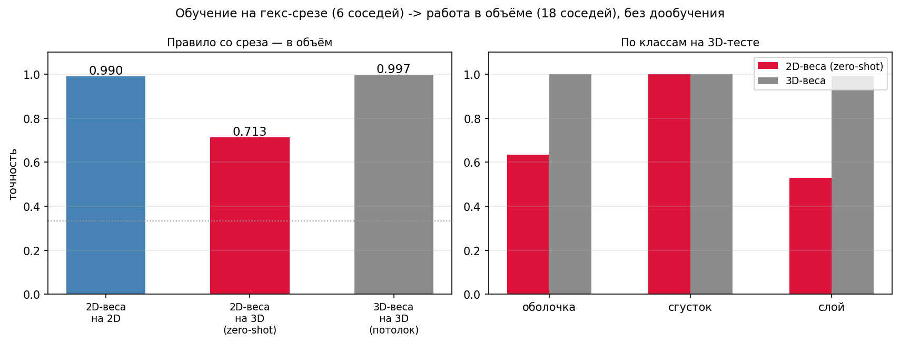

---

## 12. Регрессия: найти центр узора

Задача «где», а не «что». Координаты узлов даны процессом роста от центра бесплатно;
сеть учится только вниманию. Средняя ошибка локализации (в шагах решётки): центроид
входа — 1.59, MLP — 1.10, **решётка с вниманием — 0.57**. Точнее шага решётки —
за счёт интерполяции взвешиванием координат.

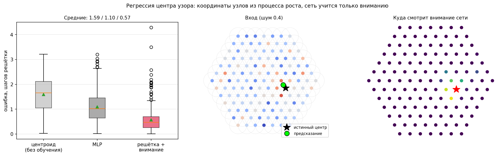

---

## Главные выводы

1. Структура «как у Цветка жизни» обучаема — в 2D, в 3D и в растущем варианте, где
   сеть строит сама себя кольцо за кольцом.
2. Геометрия делает измеримую работу: +18 пунктов против случайного графа при
   идентичных параметрах. Особенна не шестиугольность, а регулярность + локальность
   + общие веса.
3. 203 параметра бьют 8 387: правильная структура заменяет параметры, а при дефиците
   данных — и данные (50 примеров против 900 у MLP).
4. Локальное правило универсально: переносится на решётки другого размера и частично
   из сечения в объём. Число параметров не зависит от размера структуры.
5. В 3D правило Цветка жизни даёт 18 соседей, а не 12, и решётку плотнее FCC.
6. Слабое звено — централизация: во всех стресс-тестах первым ломался глобальный
   пуллинг, а не сама решётка.

## Оговорки

Все задачи синтетические, их сложность задана параметрами генерации; абсолютные
проценты сравнимы только внутри серии. Большинство точек — один прогон с одним сидом;
для публикационного уровня нужно усреднение по сидам. Преимущество решётки ожидаемо
проявляется на пространственных задачах; на данных без геометрии его не будет.

## Запуск

```bash
pip install numpy matplotlib scipy
python flower_of_life_net.py     # 2D, базовый эксперимент
python flower_of_life_18.py      # 3D, 18-связность
```

У каждого скрипта параметры запуска описаны в шапке. Рядом с каждым — одноимённый
`.png` с результатами. Веса и промежуточные состояния (`*.npz`) не хранятся в
репозитории — они воспроизводятся запуском скриптов.

Полный технический отчёт со всеми деталями методики — в
[FLOWER_OF_LIFE_REPORT.md](FLOWER_OF_LIFE_REPORT.md).
